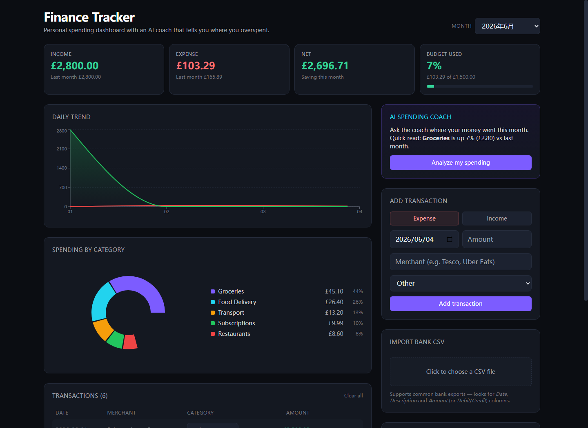

# Finance Tracker with AI Coach / 个人财务追踪与消费建议工具

## Overview / 项目简介

Finance Tracker is a single-user budgeting dashboard built with Next.js. It supports manual transactions, CSV import, category analytics, monthly budgets and an optional AI coach that summarises spending changes when an Anthropic API key is configured.

Finance Tracker 是一个单用户个人财务追踪项目，使用 Next.js 构建。它支持手动记账、CSV 导入、分类统计、月度预算，以及在配置 Anthropic API key 后生成消费建议的可选 AI coach。

## Why I Built This / 项目背景

I built this as a portfolio MVP to practise product-style frontend work with real state management, charts and CSV parsing. The project is intentionally local-first: transactions are stored in the browser, so it can be tested without a database.

这个项目是我为了练习作品集型前端产品而做的 MVP，重点包括状态管理、图表展示、CSV 解析和预算逻辑。项目刻意保持 local-first，交易数据存在浏览器里，不需要数据库也能测试。

## My Contributions / 我的工作

- Built the dashboard layout, transaction form, transaction list and budget panel.
- Implemented local persistence with `localStorage`.
- Added CSV import with flexible column handling for common bank export formats.
- Implemented merchant-name auto-categorisation with regex rules.
- Built monthly analytics, category breakdown and daily trend charts.
- Added an optional server-side Anthropic API route for spending insights.
- Added a deterministic fallback coach when no API key is set.

- 完成仪表盘布局、交易表单、交易列表和预算面板。
- 使用 `localStorage` 实现本地数据持久化。
- 实现 CSV 导入，兼容常见银行流水字段格式。
- 使用商户名称正则规则实现自动分类。
- 实现月度统计、分类占比和每日趋势图。
- 增加可选的服务端 Anthropic API 路由，用于生成消费洞察。
- 在没有 API key 时提供确定性 fallback 建议，方便本地演示。

## Tech Stack / 技术栈

- Next.js 14
- React 18
- TypeScript
- Tailwind CSS
- Recharts
- PapaParse
- Anthropic SDK
- Browser `localStorage`

## Features / 主要功能

- Add, edit and delete transactions.
- Import demo or bank-style CSV data.
- Auto-categorise merchants into expense categories.
- View monthly income, expense, net balance and budget usage.
- Review spending by category and daily trend.
- Set monthly and category budgets.
- Compare current month with the previous month.
- Generate AI or heuristic spending notes.

## Results / 项目成果

The project runs locally and includes `sample-statement.csv` for quick testing. It can show spending patterns across April and May 2026 from the sample file, and the coach panel can work in heuristic mode without external credentials.

项目可以本地运行，并提供 `sample-statement.csv` 用于快速测试。示例数据覆盖 2026 年 4 月和 5 月，可以展示月度对比、分类消费和预算进度；没有 API key 时，coach 面板会使用规则逻辑生成建议。

## How to Run / 如何运行

```bash
npm install
cp .env.example .env.local
npm run dev
```

Open <http://localhost:3000>.

To test quickly, import `sample-statement.csv` from the project root.

Optional `.env.local`:

```bash
ANTHROPIC_API_KEY=
ANTHROPIC_MODEL=claude-sonnet-4-6
```

If `ANTHROPIC_API_KEY` is empty, the app still runs and uses heuristic coaching.

如果不配置 `ANTHROPIC_API_KEY`，项目仍然可以运行，并使用规则逻辑生成消费建议。

## Screenshots / Results Preview



## Limitations / 当前限制

- Data is stored only in the current browser.
- No account system or cloud sync.
- CSV parsing supports common English headers, but not every bank format.
- Currency is display-only; there is no exchange-rate conversion.
- AI advice depends on user-provided data and should be treated as budgeting notes, not financial advice.

## Future Improvements / 后续改进

- Add tests for CSV parsing, category rules and monthly analytics.
- Add screenshot assets for README.
- Add export for cleaned transactions.
- Add more category rules and custom categories.
- Add database storage only if multi-device sync becomes a goal.

## What I Learned / 我的收获

This project helped me practise building a dashboard from raw transaction data. The hardest part was making the CSV import and category logic tolerant enough for messy real-world inputs.

这个项目让我练习了如何从原始交易数据搭建可读的财务面板。最需要耐心的是 CSV 导入和自动分类，因为真实数据字段和商户名称经常不统一。
